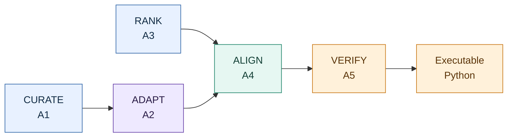
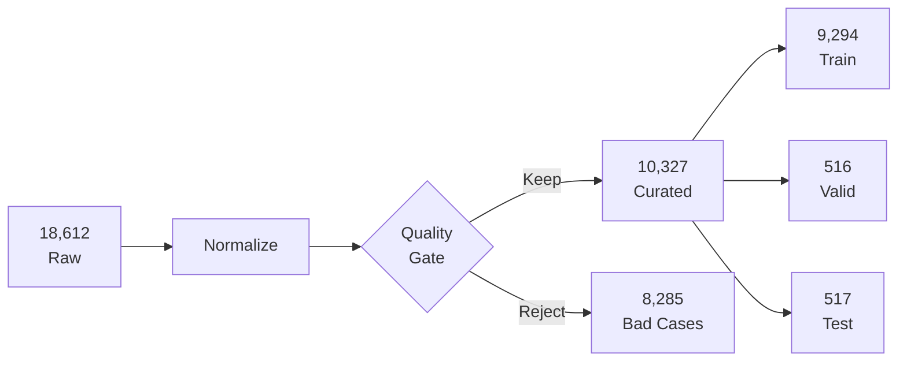
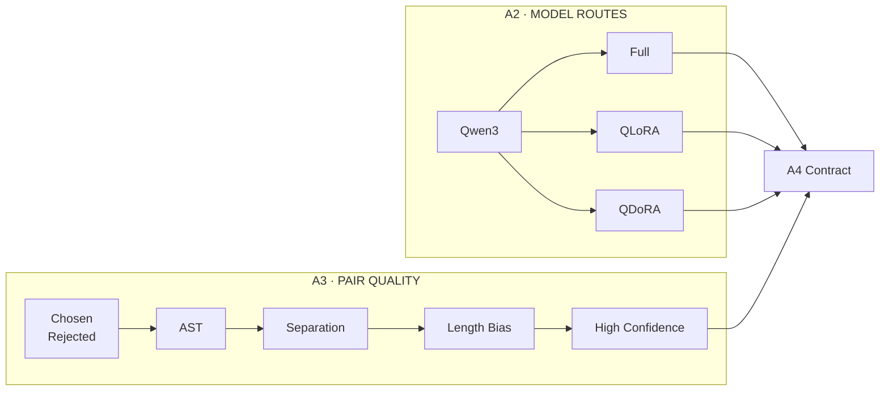
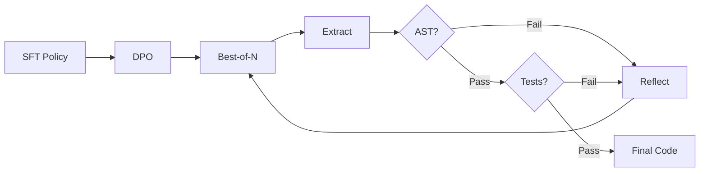

# BEYOND LIKELIHOOD

## An Execution-Guided Python Code Generation System

### Curate · Adapt · Align · Reason · Verify

**[Team Name]** · **[Team Leader Name]** · **Su Kun** · **[A1 Member Name]**  
*[Department / Institution] · 2026 Midterm Project Review*

> ## Reliable Code = Clean Supervision × Adapted Policy × Preference Signal × Execution Feedback

| **44.5%** | **< 1%** | **8.8K** | **+8.6 pp** |
|:---:|:---:|:---:|:---:|
| noisy SFT samples removed | trainable PEFT parameters | high-confidence preference pairs | MBPP pass@1 with LoRA-DPO* |

---

## One System, Five Evidence-Bearing Stages



- **Backbone:** Qwen3-0.6B
- **Training:** Full SFT · QLoRA · QDoRA · DPO
- **Reasoning:** CoT · Best-of-N · Self-Consistency · Reflexion
- **Evidence:** AST validity · unit tests · MBPP pass@1

---

# A1 | TRUST THE DATA

**Owner:** [A1 Member Name]

## Research Question

- **Noisy targets:** Which samples deserve gradient updates?
- **Split drift:** Can every model face the same test set?
- **Opaque preprocessing:** Can every removal be explained?

## Proposed Solution

- **Schema unification:** Parquet → Alpaca-style JSON
- **Quality gate:** Instruction + length + deduplication + AST
- **Frozen split:** Seed-42 90% / 5% / 5%
- **Audit trail:** Statistics + previews + rejected cases



### What A1 Contributes

- **44.5% noise removed:** weak instructions and invalid code
- **One immutable split:** fair Full / QLoRA / QDoRA comparison
- **LLaMA-Factory ready:** data + registry + audit report

---

# A2–A3 | ADAPT EFFICIENTLY. PREFER RELIABLY.

**Owner:** Su Kun

## Research Question

- **Memory–quality gap:** Full capacity on a 23 GiB vGPU?
- **False preferences:** Is “chosen” actually more learnable?
- **Interface fragility:** Can A4 consume every artifact directly?

## Proposed Solution

- **Matched ladder:** Base → Full → QLoRA → QDoRA
- **Qwen3 contract:** bf16 + 2K context + no-thinking targets
- **Pair scorecard:** Syntax + separation + length bias
- **Data views:** Raw + clean + high-confidence + debug
- **Bridge-first output:** Manifest + registry + DPO probe



### What A2–A3 Contribute

- **0.84% trainable:** QLoRA updates 5.05M parameters
- **0.90% trainable:** QDoRA adds magnitude learning
- **40.7% less memory:** QLoRA 8.02 vs. Full 13.52 GiB
- **8,797 preference pairs:** high-confidence A4 input
- **3 / 3 bridge checks:** Full, QLoRA, and QDoRA load in A4

---

# A4–A5 | ALIGN THE MODEL. VERIFY THE ANSWER.

**Owner:** [Team Leader Name]

## Research Question

- **Likelihood ≠ correctness:** Fluent code may still fail tests.
- **SFT lacks ranking:** Better and worse answers look equivalent.
- **One sample ≠ reliability:** A single trajectory is fragile.

## Proposed Solution

- **DPO objective:** Enlarge the chosen–rejected reward margin
- **Candidate search:** CoT + Best-of-N + Self-Consistency
- **Execution feedback:** Extract → AST → tests → rerank
- **Reflexion loop:** Convert failures into repair prompts



### What A4–A5 Contribute

- **Pairwise alignment:** Learn quality beyond token likelihood
- **Two-stage optimization:** Model weights + inference search
- **Executable feedback:** Correctness, not surface similarity
- **11.3% → 19.8% pass@1:** component-level LoRA-DPO result*
- **13.6% → 89.9% syntax:** stronger output discipline*

---

## Why This Is More Than “Fine-Tune and Test”

- **Data before models:** reject unreliable supervision first
- **Matched ablations:** change one adaptation mechanism at a time
- **Quality before DPO:** audit the preference signal itself
- **Tests before claims:** execute code instead of trusting fluency
- **Contracts before integration:** version every dataset and model

---

## Evaluation That Matches the Task

| **Model Quality** | **Code Reliability** | **System Efficiency** |
|---|---|---|
| Validation loss | Syntax pass rate | Peak GPU memory |
| Reward margin | Unit-test pass rate | Trainable parameters |
| Preference accuracy | MBPP pass@1 | Throughput and latency |

```text
Same data + Same prompt + Same decoding + Same tests
                         ↓
                  Defensible comparison
```

---

## TAKE-HOME MESSAGE

> # We do not merely generate Python. We curate what the model learns, align what it prefers, and execute what it produces.

**Next:** freeze the new data versions → select the best A2 policy → run integrated A4 alignment → quantify each A5 reasoning gain.

---

## Footnote for the Printed Poster

\* A2 memory values are measured under one matched 30-step feasibility protocol. A4 values are component-level MBPP Sanitized results under one shared zero-shot execution protocol. The fully integrated benchmark is the next milestone.

---

# Layout Notes — Remove Before Printing

- **Canvas:** landscape A0 or 16:9 display
- **Top band:** title + equation + four number cards
- **Center:** three equal member columns
- **Bottom band:** evaluation + take-home message
- **Bullet rule:** one technical label + one action; never a paragraph
- **Typography:** title 80–96 pt; cards 40–52 pt; body 24–28 pt
- **Color map:** A1/A3 blue; A2 violet; A4/A5 teal; evaluation amber
- **Replace Mermaid:** export as vector diagrams before printing
- **Replace placeholders:** team, leader, A1 member, and institution

## Evidence Sources — Not Printed

- A1: `sft/data/data_statistics.json`
- A2: `sft/outputs/a2_v2_runs/a2_v2_accept_20260702_impl/reports/comparison_report.json`
- A3: `dpo/data/a3_v2_runs/a3_v2_verify_20260702_005837/data_statistics.json`
- A4: `dpo/outputs/mbpp_eval_qwen3_base/mbpp_metrics.json`
- A4: `dpo/outputs/mbpp_eval_qwen3_06b_lora_dpo/mbpp_metrics.json`
