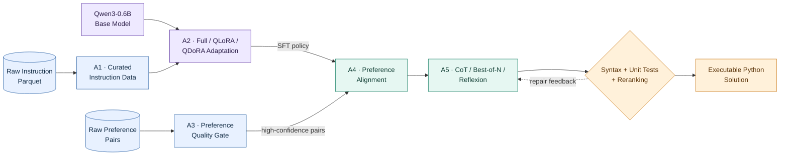
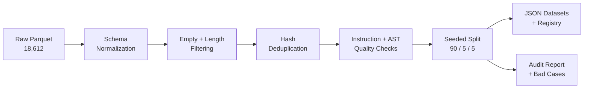
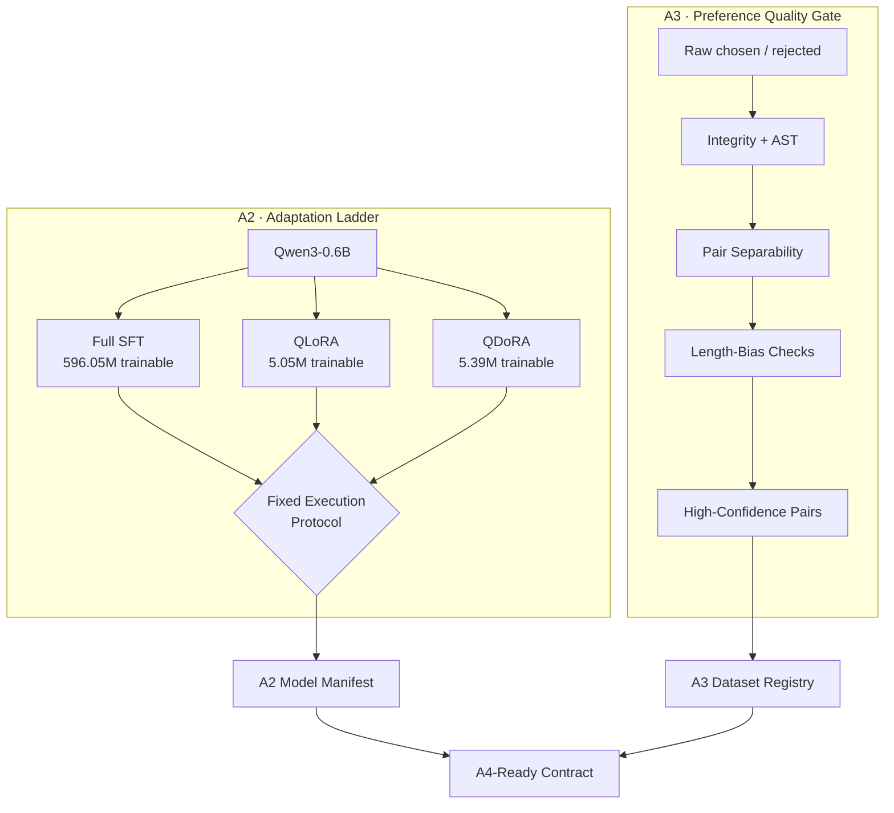
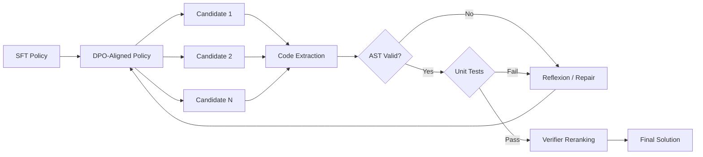

# A Qwen3-Based Python Code Generation System with Data-Centric Fine-Tuning, Preference Alignment, and Execution-Guided Inference

## Resource-Efficient Adaptation and Verifiable Reasoning from Curated Supervision to Executable Code

**[Team Name]** · **[Team Leader Name]** · **Su Kun** · **[A1 Member Name]**  
*[Department / Institution] · 2026 Midterm Project Review*

> **Poster thesis.** Reliable code generation is not a single-model problem. Our Qwen3-centered system co-designs data curation, resource-aware adaptation, preference alignment, test-time reasoning, and execution-based verification around a compact 0.6B backbone.

---

## 1. System at a Glance

- **Data-centric:** transform noisy code corpora into versioned, auditable supervision and preference data.
- **Resource-aware:** compare Full SFT, QLoRA, and QDoRA under a controlled single-GPU budget.
- **Alignment-aware:** learn from *chosen/rejected* pairs rather than token likelihood alone.
- **Execution-aware:** select and refine generations using syntax checks and executable tests.

**Figure 1.** Contract-first architecture: A1 and A3 establish data quality; A2 produces an adapted policy; A4 and A5 improve preference compliance and inference reliability; executable tests provide the final evidence.

---

## 2. Member I — A1: Reproducible Instruction Data Foundation

**Owner:** [A1 Member Name]

### Research Question

- **Schema mismatch:** raw Parquet fields are not directly consumable by LLaMA-Factory.
- **Supervision noise:** empty answers, malformed code, weak instructions, and duplicates can corrupt SFT gradients.
- **Evaluation variance:** unstable train/test partitions make model comparisons scientifically invalid.
- **Traceability gap:** a dataset without statistics and bad-case records is difficult to audit or reproduce.

### Proposed Solution

- Normalize heterogeneous records into an **Alpaca-style instruction contract**.
- Apply **empty-value, hash-deduplication, length, instruction-quality, and Python-syntax filters**.
- Construct a deterministic **90% / 5% / 5% split with seed 42**.
- Export LLaMA-Factory JSON, `dataset_info.json`, statistics, previews, and rejected cases.
- Freeze dataset versions so every model is evaluated on the **same data contract**.

### Midterm Evidence

- **18,612** raw instruction records audited.
- **10,327** usable records retained after strict quality filtering.
- **9,294 / 516 / 517** deterministic train/validation/test samples.
- **8,285 noisy records removed**, including weak instructions and syntax-invalid targets.

---

## 3. Member II — A2 & A3: Resource-Aware Adaptation and Preference Data Quality

**Owner:** Su Kun

### Research Question

- **Adaptation trade-off:** how much specialization can a 0.6B model gain under a constrained vGPU budget?
- **PEFT comparison:** when do QLoRA and QDoRA approach Full SFT while updating less than 1% of parameters?
- **Preference noise:** are *chosen/rejected* pairs genuinely separable, executable, and free from trivial length bias?
- **Interface reliability:** can A2 models and A3 datasets be consumed by A4 without manual format repair?

### Proposed Solution

- Build a controlled ladder: **Qwen3 Base → Full SFT → QLoRA → QDoRA**.
- Use **NF4 double quantization**, low-rank adapters, bf16 compute, and calibrated batching.
- Disable unsupported reasoning targets with `template: qwen3` and `enable_thinking: false`.
- Select checkpoints using validation loss plus **execution-aware MBPP metrics**.
- Score preference pairs by **integrity, syntax, separability, length safety, balance, and format**.
- Export **raw / clean / high-confidence / debug / generation-test** views with sidecar audits.
- Isolate every experiment by `RUN_ID`, hashes, manifests, telemetry, and an A2→A3→A4 bridge.

### Midterm Evidence

- **40.7% lower peak allocation:** QLoRA 8.02 GiB vs. Full SFT 13.52 GiB.
- **39.0% lower peak allocation:** QDoRA 8.24 GiB vs. Full SFT 13.52 GiB.
- **< 1% trainable parameters:** QLoRA 0.84%; QDoRA 0.90%.
- **9,466** raw preference records audited; **8,797** high-confidence training pairs produced.
- **128** deterministic debug pairs and **485** held-out generation cases exported.
- Full, QLoRA, and QDoRA outputs each passed an independent **A4 one-step DPO bridge**.

> *Measurement note:* memory figures are from the same controlled 30-step feasibility protocol and demonstrate resource behavior, not final model ranking.

---

## 4. Team Lead — A4 & A5: Preference Alignment and Test-Time Reliability

**Owner:** [Team Leader Name]

### Research Question

- **Residual failures:** SFT outputs may remain syntactically invalid, logically incomplete, or non-executable.
- **Missing preference signal:** maximum-likelihood SFT cannot explicitly distinguish better code from plausible but inferior code.
- **Single-sample variance:** one decoding trajectory is fragile for tasks requiring multi-step reasoning.
- **Verification gap:** fluent code is not necessarily correct code.

### Proposed Solution

- Apply **Direct Preference Optimization (DPO)** to increase the likelihood margin between chosen and rejected solutions.
- Monitor `rewards/chosen`, `rewards/rejected`, `rewards/margins`, and `rewards/accuracies` for alignment stability.
- Add **Chain-of-Thought, Best-of-N, Self-Consistency, and Reflexion** as complementary test-time strategies.
- Extract candidate code, run **AST validation and unit tests**, then rerank or repair failed candidates.
- Separate parameter-level alignment from inference-time search to enable clean ablations.

### Midterm Evidence

- Under one shared zero-shot MBPP execution protocol, the component-level LoRA-DPO checkpoint achieved **19.84% pass@1 (51/257)**.
- The Qwen3 base checkpoint achieved **11.28% pass@1 (29/257)** under the same protocol.
- Syntax validity increased from **13.62% to 89.88%**, showing that alignment strongly improved output-format discipline.
- The full A2→A3→A4→A5 integrated benchmark remains the next controlled evaluation milestone.

---

## 5. Quantitative Midterm Snapshot

| Evidence Track | Result | Why It Matters |
|---|---:|---|
| A1 retention | 10,327 / 18,612 | Strict filtering prevents noisy supervision |
| A1 deterministic split | 9,294 / 516 / 517 | Fair comparisons across model variants |
| A3 high-confidence pairs | 8,797 | Auditable preference signal for alignment |
| QLoRA trainable ratio | 0.84% | Parameter-efficient specialization |
| QDoRA trainable ratio | 0.90% | Controlled PEFT extension at low rank |
| QLoRA memory reduction | 40.7% | Feasible training under constrained VRAM |
| A4 DPO feasibility | 11.28% → 19.84% pass@1 | Preference learning improves executable success |
| Integration probes | 3 / 3 passed | Full, QLoRA, and QDoRA are A4-consumable |

---

## 6. What Is Technically Distinctive?

- **Not a single fine-tuning run:** the system studies the complete path from corpus quality to executable output.
- **Controlled innovation:** QDoRA is compared against Full SFT and QLoRA under matched data and evaluation contracts.
- **Preference quality before alignment:** A3 audits whether pair labels contain a learnable signal instead of trusting raw rankings.
- **Execution-aware selection:** syntax and unit tests complement validation loss for code-specific model selection.
- **Contract-first collaboration:** versioned manifests connect independently developed modules without hidden assumptions.
- **Honest evidence hierarchy:** feasibility probes, component benchmarks, and integrated results are reported separately.

---

## 7. Evaluation Protocol

- **Backbone:** local Qwen3-0.6B, bf16 compute, non-thinking training template.
- **Training:** matched data versions, deterministic seeds, Full SFT / QLoRA / QDoRA ablations.
- **Benchmark:** MBPP Sanitized with deterministic generation.
- **Primary metrics:** pass@1, syntax pass rate, average test pass rate, signature accuracy.
- **Efficiency metrics:** peak GPU memory, trainable-parameter ratio, throughput, and latency.
- **Reliability analysis:** extraction failures, syntax errors, runtime errors, timeouts, and boundary-case failures.

---

## 8. Take-Home Message

> **Compact models become substantially more reliable when data quality, adaptation, preference learning, inference-time search, and executable verification are optimized as one modular system.**

**Next milestone:** freeze the new A1/A3 dataset versions, complete the matched Full/QLoRA/QDoRA evaluation, initialize A4 from the selected A2 policy, and quantify the incremental benefit of each A5 reasoning strategy.

---

# Layout Notes — Not Part of the Printed Poster

## Recommended canvas

- Landscape A0 or 16:9 digital wall display.
- Header: 12–15% height; system overview: 20%; three member columns: 45%; results and takeaway: 20–23%.
- Use a **three-column member layout** with equal visual weight:
  - left: A1;
  - center: A2/A3;
  - right: A4/A5.

## Visual hierarchy

- Title: 72–96 pt equivalent.
- Section titles: 34–42 pt.
- Body bullets: 22–28 pt; no bullet should exceed two lines in the final layout.
- Highlight only numbers and method names; avoid bolding full sentences.
- Convert Mermaid diagrams into vector graphics before printing.

## Suggested palette

- Navy `#102A43`: title and structural text.
- Blue `#3267A8`: data pipeline / A1 / A3.
- Violet `#6842A8`: model adaptation / A2.
- Teal `#21856B`: alignment and reasoning / A4 / A5.
- Amber `#C97918`: evaluation and key metrics.
- Off-white `#F7F9FC`: background.

## Claim discipline

- The A1 statistics shown here correspond to the latest curated A1 artifact.
- A2 memory numbers come from the controlled 30-step feasibility run; label them accordingly.
- A4 MBPP numbers are component-level results under one fixed execution protocol, not yet the final integrated system benchmark.
- Do not add “state of the art,” “significant,” or “production-ready” without an appropriate baseline and uncertainty analysis.
- Replace `[Team Name]`, `[Team Leader Name]`, `[A1 Member Name]`, and `[Department / Institution]` before layout.

## Optional visual replacements

1. Replace the A1 Mermaid flow with a horizontal filtering funnel showing 18,612 → 10,327.
2. Replace the A2 ladder with a grouped bar chart for trainable parameters and peak memory.
3. Replace the A3 pipeline with a five-axis quality-score radar or filtering funnel.
4. Replace A4/A5 Mermaid with a circular generate–verify–repair loop.
5. Add a small MBPP bar chart: Base 11.28% vs. LoRA-DPO 19.84%.

## Evidence provenance for the design team

- A1: `sft/data/data_statistics.json`
- A2 feasibility: `sft/outputs/a2_v2_runs/a2_v2_accept_20260702_impl/reports/comparison_report.json`
- A3: `dpo/data/a3_v2_runs/a3_v2_verify_20260702_005837/data_statistics.json`
- A4 component evaluation: `dpo/outputs/mbpp_eval_qwen3_base/mbpp_metrics.json` and `dpo/outputs/mbpp_eval_qwen3_06b_lora_dpo/mbpp_metrics.json`
